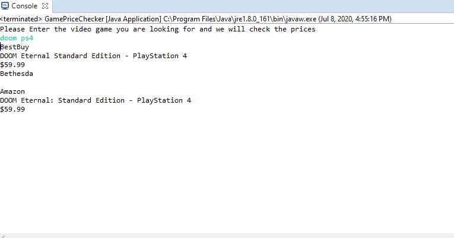
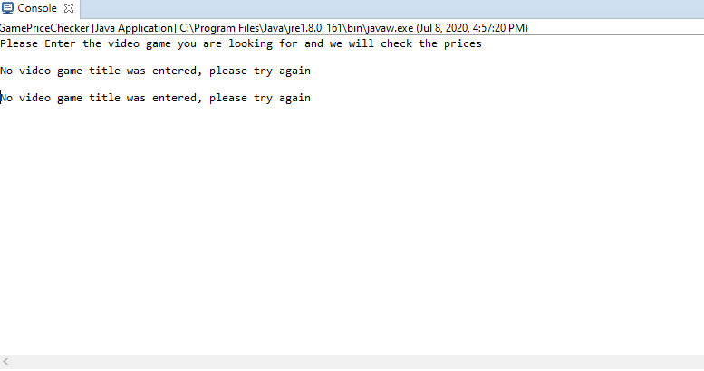

# GamePriceCheck
A small project made using Java that scrapes information from both BestBuy and Amazon in order to compare prices of a video game that a user searches for.
Its heavily dependant on both website layouts of bestbuy and amazon and also the search engine of both websites. It pulls information from the top search result.
So far it can pull price, title, and platform but can be modified to pull more.
# Installion
The following program relies on the HTMLunit JAR which you can download here [HtmlUnit](https://sourceforge.net/projects/htmlunit/files/htmlunit/) 

1. Create a project on an IDE of your choice
2. Download and add the HtmlUnit JAR to your Java build path
3. Clone the Repository
4. Add the java classes to your project
5. Run and compare prices 

# Screenshots

